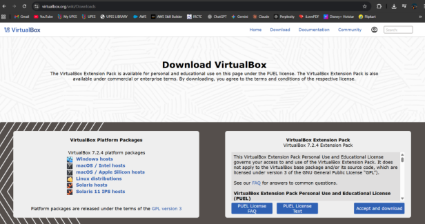
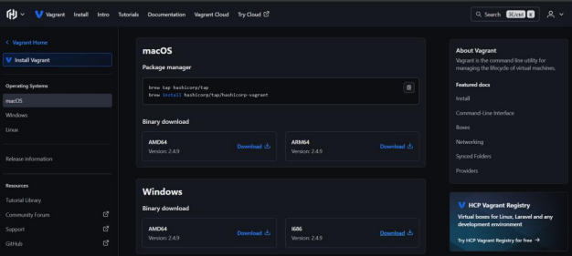
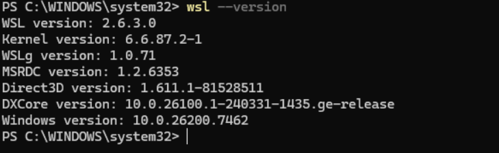
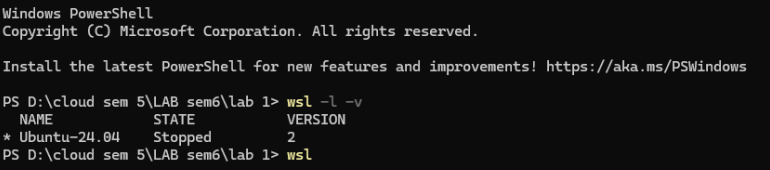
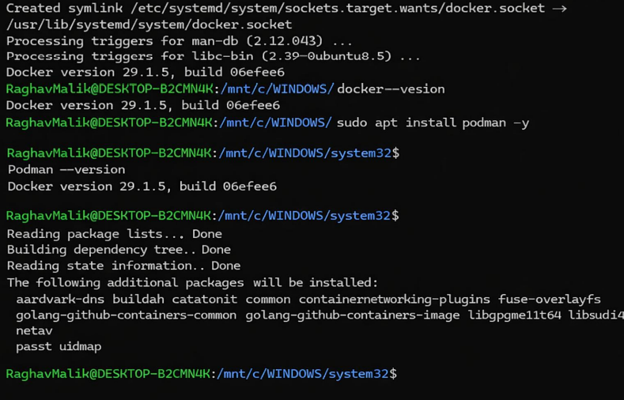
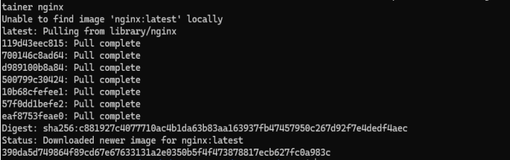
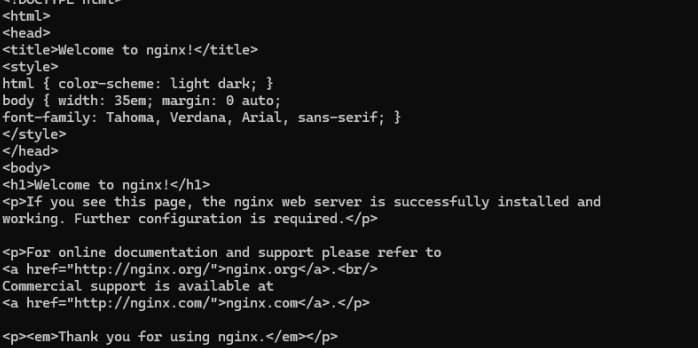
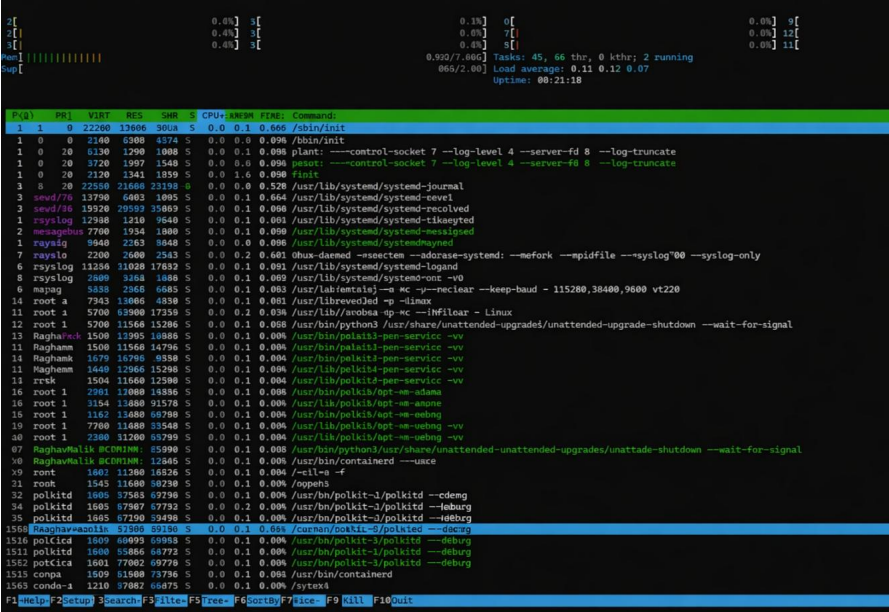
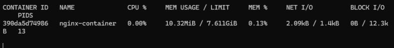
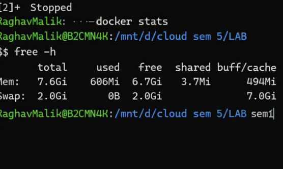

# Containerization and DevOps Lab  
## EXPERIMENT – 01  

**Name:** Raghav Malik  
**Batch:** B3  
**SAP ID:** 500125292  
**Roll No:** R2142231423  

---

# 1️ Objective

- To understand the conceptual and practical differences between Virtual Machines and Containers.  
- To install and configure a Virtual Machine using VirtualBox and Vagrant on Windows.  
- To install and configure Containers using Docker inside WSL.  
- To deploy an Ubuntu-based Nginx web server in both environments.  
- To compare resource utilization, performance, and operational characteristics of VMs and Containers.  

---

# 2️ Theory

## 2.1 Virtual Machine (VM)

A Virtual Machine emulates a complete physical computer, including its own operating system kernel, hardware drivers, and user space. Each VM runs on top of a hypervisor.

### Characteristics:
- Full OS per VM  
- Higher resource usage  
- Strong isolation  
- Slower startup time  

---

## 2.2 Container

Containers virtualize at the operating system level. They share the host OS kernel while isolating applications and dependencies in user space.

### Characteristics:
- Shared kernel  
- Lightweight  
- Fast startup  
- Efficient resource usage  

---

# 3️ Experiment Setup – Part A: Virtual Machine (Windows)

## Step 1: Install VirtualBox

- Download VirtualBox from the official website.  
- Run the installer with default settings.  
- Restart the system if prompted.  



---

## Step 2: Install Vagrant

- Download Vagrant for Windows.  
- Install using default settings.  

Verify installation:

```bash
vagrant --version
```



---

## Step 3: Create Ubuntu VM using Vagrant

Initialize Vagrant:

```bash
vagrant init hashicorp/bionic64
```

Start the VM:

```bash
vagrant up
```

Explanation:

- `vagrant init hashicorp/bionic64` creates a **Vagrantfile** in the project folder.  
- `hashicorp/bionic64` refers to Ubuntu 18.04 LTS (64-bit).  
- `vagrant up` reads the Vagrantfile, downloads the image (if needed), allocates CPU/RAM, and boots the VM.  

Access the VM:

```bash
vagrant ssh
```

This connects to the VM via SSH without requiring a password.

---

## Step 4: Install Nginx inside VM

```bash
sudo apt update
sudo apt install -y nginx
sudo systemctl start nginx
```

Measure startup time:

```bash
time systemctl start nginx
```

---

## Step 5: Verify Nginx

```bash
curl localhost
```

Stop and remove VM:

```bash
vagrant halt
vagrant destroy
```

---

# 4️ Experiment Setup – Part B: Containers using WSL

## Step 1: Install WSL 2

```bash
wsl --install
```

Verify installation:

```bash
wsl --version
```



---

## Step 2: Install Ubuntu on WSL

```bash
wsl --install -d Ubuntu
```

Verify:

```bash
wsl -l -v
```



---

## Step 3: Install Docker Engine inside WSL

```bash
sudo apt update
sudo apt install -y docker.io
sudo systemctl start docker
sudo usermod -aG docker $USER
```

Verify Docker:

```bash
docker --version
```



---

## Step 4: Run Nginx Container

Pull image:

```bash
docker pull ubuntu
```

Run container:

```bash
docker run -d -p 8080:80 --name nginx-container nginx
```



Explanation:

- `docker pull ubuntu` downloads the Ubuntu image from Docker Hub.  
- `docker run -d -p 8080:80 --name nginx-container nginx` runs Nginx in detached mode and maps port 8080 to container port 80.  

---

## Step 5: Verify Nginx in Container

```bash
curl localhost:8080
```



---

# 5️ Resource Utilization Observation

## 5.1 VM Observation Commands

Memory usage:

```bash
free -h
```

Real-time monitoring:

```bash
htop
```



Boot time:

```bash
systemd-analyze
```


---

## 5.2 Container Observation Commands

Container resource usage:

```bash
docker stats
```



Memory usage:

```bash
free -h
```



---

# 6️ Comparison: Virtual Machine vs Container

| Parameter | Virtual Machine | Container |
|------------|----------------|------------|
| Boot Time | Slower (Full OS boot) | Very Fast |
| RAM Usage | High | Low |
| CPU Overhead | Higher | Minimal |
| Disk Usage | Large | Lightweight |
| Isolation | Strong | Moderate |

---

# 7️ Conclusion

Virtual Machines provide strong isolation and are suitable for legacy systems and full OS environments.  

Containers are lightweight, start quickly, consume fewer resources, and are ideal for modern DevOps workflows and microservices architecture.