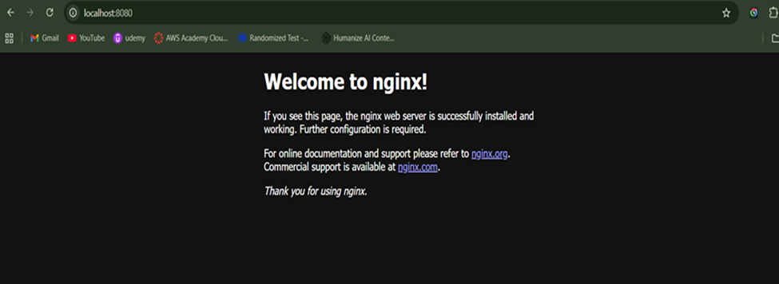
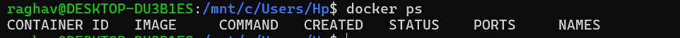
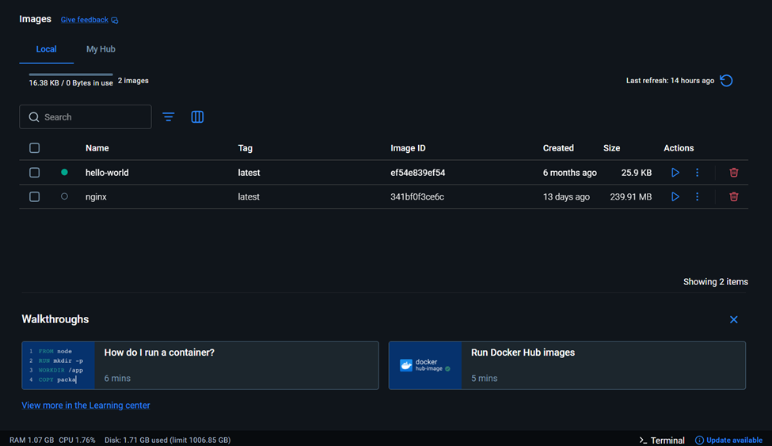
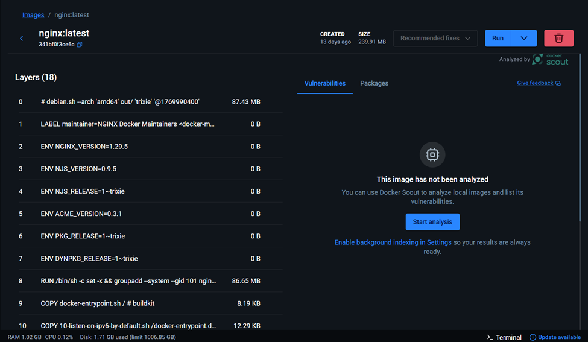
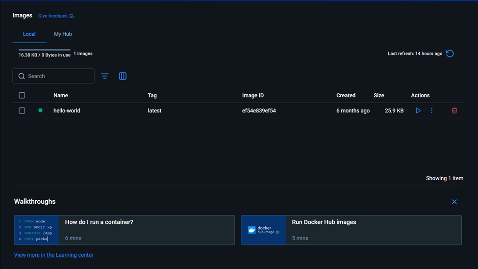

# Containerization and DevOps Lab  
## EXPERIMENT – 02  

# Docker Installation, Configuration, and Running Images  
**Name:** Raghav Malik  
**Batch:** B3  
**SAP ID:** 500125292  
**Roll No:** R2142231423  
---

## Aim

To install and configure Docker, pull Docker images, run containers, and manage the container lifecycle using Docker commands.

---

## Objectives

- To pull Docker images from Docker Hub  
- To run containers with port mapping  
- To verify running containers  
- To manage container lifecycle (start, stop, remove)  

---

## Theory

Docker is an open-source containerization platform that allows applications to be packaged along with their dependencies into lightweight and portable containers. Containers run on a shared operating system kernel, making them faster and more resource-efficient than traditional Virtual Machines.

A **Docker Image** is a read-only template used to create containers.  

A **Docker Container** is a running instance of a Docker image.  

Docker follows a client–server architecture, where:

- The **Docker Client** sends commands  
- The **Docker Daemon** executes them  
- Docker Hub stores container images  

---

## Software Requirements

- Windows Operating System  
- Docker Desktop (with WSL integration)  
- Ubuntu (WSL distribution)  

---

# Procedure / Steps to Perform the Experiment

---

## Step 1: Pull Docker Image

Pull the Nginx image from Docker Hub:

```bash
docker pull nginx
```


---

## Step 2: Run Container with Port Mapping

Run the Nginx container in detached mode:


```bash
docker run -d -p 8080:80 nginx
```

### Explanation:

- `-d` → Runs container in background (detached mode)  
- `-p 8080:80` → Maps host port 8080 to container port 80  
- `nginx` → Docker image name  

---

## Step 3: Verify Running Containers

To check running containers:

```bash
docker ps
```


This command displays:


- Container ID  
- Image name  
- Container status  
- Port mapping  



---

## Step 4: Stop and Remove Container

To stop the running container:

```bash
docker stop <container_id>
```

To remove the container:

```bash
docker rm <container_id>
```

---

## Step 5: Remove Docker Image

To remove the downloaded image:

```bash
docker rmi nginx
```


This frees disk space by deleting the unused image.

---

# Result

Docker images were successfully pulled.  
Containers were executed using port mapping.  
Container lifecycle management commands (start, stop, remove) were performed successfully.

---

# Conclusion

This experiment demonstrated the installation and practical usage of Docker for container-based application deployment. Docker provides a lightweight, efficient, and portable environment for running applications, making it highly suitable for modern DevOps and cloud-native architectures.

---

# Viva-Voce Questions

1. What is a Docker Image?  
2. What is a Docker Container?  
3. What is the difference between `docker run` and `docker start`?  
4. What is the purpose of port mapping in Docker?  
5. Why are containers lightweight compared to Virtual Machines?  

---

# Overall Lab Conclusion

This lab demonstrated virtualization using Vagrant and VirtualBox and containerization using Docker. The experiment clearly showed the performance and resource efficiency advantages of containers. Containers are better suited for rapid deployment and microservices, whereas Virtual Machines provide stronger isolation.