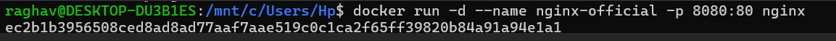
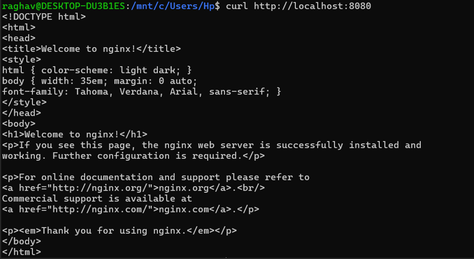
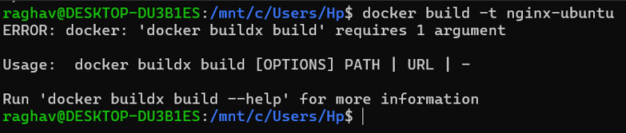
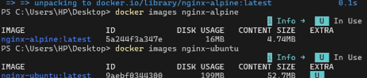
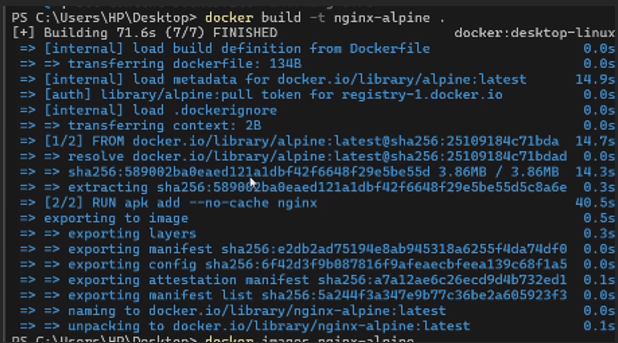
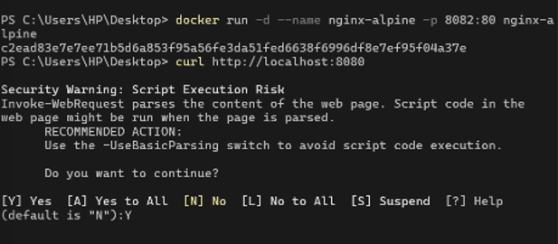
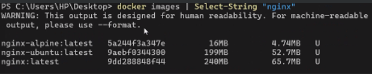
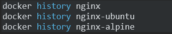
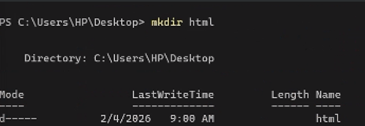
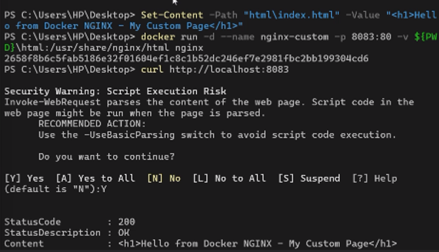

# Containerization and DevOps Lab  
## EXPERIMENT – 03  

# Deploying NGINX Web Server Using Official, Ubuntu, and Alpine Base Images and Comparing Image Layers  

---

## Aim

To deploy the NGINX web server using different Docker base images and compare their image size, performance, layers, and security impact.

---

## Objectives

After completing this experiment, students will be able to:

- Deploy NGINX using Docker containers  
- Build custom images using Dockerfile  
- Understand Docker image layers  
- Compare Ubuntu, Alpine, and Official images  
- Analyze size, speed, and security differences  
- Explain real-world uses of NGINX in containers  

---

## Prerequisites

- Docker installed and running  
- Basic Linux commands  
- Knowledge of:
  - `docker pull`
  - `docker run`
  - `docker build`
  - Dockerfile
  - Port mapping  

---

# Theory

## What is NGINX?

NGINX is a high-performance:

- Web Server  
- Reverse Proxy  
- Load Balancer  
- API Gateway  

It uses an **event-driven asynchronous architecture**, making it faster and more scalable than traditional servers like Apache.

---

## What is Docker?

Docker is a containerization platform that:

- Packages applications with dependencies  
- Ensures portability  
- Provides lightweight virtualization  
- Speeds up deployment  

---

## What are Docker Image Layers?

Docker images are built in layers.

Each instruction in a Dockerfile creates a layer:

- `FROM`
- `RUN`
- `COPY`
- `ADD`

### Importance of Layers

- More layers → Bigger image  
- Bigger images → Slower pull time  
- Larger images → More vulnerabilities  
- Fewer layers → Faster and more secure  

---

## Base Image Types

| Base Image        | Description                              |
|-------------------|------------------------------------------|
| Official nginx    | Pre-built optimized production image     |
| Ubuntu            | Full Linux OS with tools                 |
| Alpine            | Lightweight minimal Linux                |

---

# Experiment Procedure

---

# Part 1 — Deploy NGINX Using Official Image

## Step 1: Pull Image


```bash
docker pull nginx:latest
```

## Step 2: Run Container

```bash
docker run -d --name nginx-official -p 8080:80 nginx
```


## Step 3: Verify

```bash
curl http://localhost:8080
```

OR open in browser:

```
http://localhost:8080
```

### Observations

```bash
docker images nginx
```

- Pre-optimized  
- Minimal configuration  
- Production ready  
- Medium size (~140MB)  

---

# Part 2 — Custom NGINX Using Ubuntu Base Image

## Step 1: Create Dockerfile

Create a file named `Dockerfile`:

```dockerfile
FROM ubuntu:22.04

RUN apt-get update && \
    apt-get install -y nginx && \
    apt-get clean && \
    rm -rf /var/lib/apt/lists/*

EXPOSE 80

CMD ["nginx", "-g", "daemon off;"]
```

## Step 2: Build Image

```bash
docker build -t nginx-ubuntu .
```


## Step 3: Run Container

```bash
docker run -d --name nginx-ubuntu -p 8081:80 nginx-ubuntu
```


### Observations

```bash
docker images nginx-ubuntu
```

- Large image (~220MB+)  
- Many layers  
- Includes full OS  
- Slower startup  
- Larger attack surface 


---

# Part 3 — Custom NGINX Using Alpine Base Image

## Step 1: Create Dockerfile

```dockerfile
FROM alpine:latest

RUN apk add --no-cache nginx

EXPOSE 80

CMD ["nginx", "-g", "daemon off;"]
```

## Step 2: Build Image

```bash
docker build -t nginx-alpine .
```

## Step 3: Run Container

```bash
docker run -d --name nginx-alpine -p 8082:80 nginx-alpine
```


### Observations

```bash
docker images nginx-alpine
```

- Very small (~25–30MB)  
- Minimal dependencies  
- Faster pull time  
- Faster startup  
- More secure  

---

# Part 4 — Compare Image Sizes

```bash
docker images | grep nginx
```


### Sample Comparison

| Image Type      | Size        |
|-----------------|------------|
| nginx:latest   | ~140MB     |
| nginx-ubuntu   | ~220MB+    |
| nginx-alpine   | ~25MB      |

---

# Part 5 — Inspect Image Layers

```bash
docker history nginx
docker history nginx-ubuntu
docker history nginx-alpine
```



### Observations

- Ubuntu → Many filesystem layers  
- Alpine → Minimal layers  
- Official → Optimized layers  

---

# Part 6 — Serve Custom HTML Page

## Step 1: Create HTML File

```bash
mkdir html
echo "<h1>Hello from Docker NGINX</h1>" > html/index.html
```



## Step 2: Run Container with Volume Mapping

```bash
docker run -d \
  -p 8083:80 \
  -v $(pwd)/html:/usr/share/nginx/html \
  nginx
```

## Step 3: Verify

Open in browser:

```
http://localhost:8083
```

---

# Part 7 — Real World Uses of NGINX

NGINX is commonly used for:

- Static websites  
- Reverse proxy  
- Load balancing  
- SSL termination  
- API gateway  
- Kubernetes ingress controller  
- Microservices frontend  

---

# Result

NGINX was successfully deployed using three different base images. The size, performance, and security impact of each base image were analyzed and compared.

---

# Conclusion

This experiment demonstrated how base images significantly impact Docker image size, performance, and security.  

- Official image → Optimized and production-ready  
- Ubuntu → Large and feature-rich but heavier  
- Alpine → Lightweight, fast, and secure  

Alpine-based images are preferred for lightweight production deployments, while Ubuntu may be used when additional tools or libraries are required.