# Containerization and DevOps Lab  
## EXPERIMENT – 04  

# Docker Essentials  
## Dockerfile, .dockerignore, Tagging and Publishing

---

# Aim

To understand Dockerfile creation, use of .dockerignore, image tagging, multi-stage builds, and publishing Docker images to Docker Hub.

---

# Objectives

- Containerize an application using Dockerfile  
- Use .dockerignore to optimize image builds  
- Build and tag Docker images  
- Manage containers and images  
- Implement multi-stage builds  
- Publish images to Docker Hub  

---

# Part 1: Containerizing Applications with Dockerfile

## Step 1: Create a Simple Application

### Create Project Folder

```bash
mkdir my-flask-app
cd my-flask-app
```

### app.py

```python
from flask import Flask

app = Flask(__name__)

@app.route('/')
def hello():
    return "Hello from Docker!"

@app.route('/health')
def health():
    return "OK"

if __name__ == '__main__':
    app.run(host='0.0.0.0', port=5000)
```

### requirements.txt

```
Flask==2.3.3
```
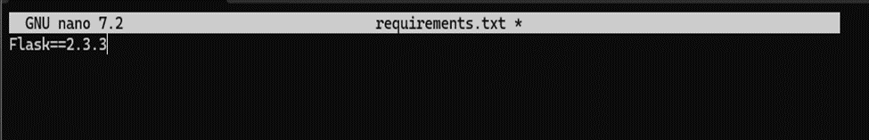
---

## Step 2: Create Dockerfile

### Dockerfile

```dockerfile
# Use Python base image
FROM python:3.9-slim

# Set working directory
WORKDIR /app

# Copy requirements file
COPY requirements.txt .

# Install dependencies
RUN pip install --no-cache-dir -r requirements.txt

# Copy application code
COPY app.py .

# Expose port
EXPOSE 5000

# Run the application
CMD ["python", "app.py"]


```

---

# Part 2: Using .dockerignore

## Step 1: Create .dockerignore File
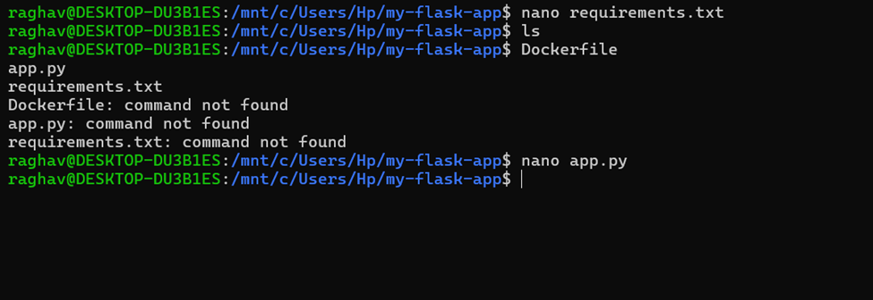

### .dockerignore

```
# Python files
__pycache__/
*.pyc
*.pyo
*.pyd

# Environment files
.env
.venv
env/
venv/

# IDE files
.vscode/
.idea/

# Git files
.git/
.gitignore

# OS files
.DS_Store
Thumbs.db

# Logs
*.log
logs/

# Test files
tests/
test_*.py
```
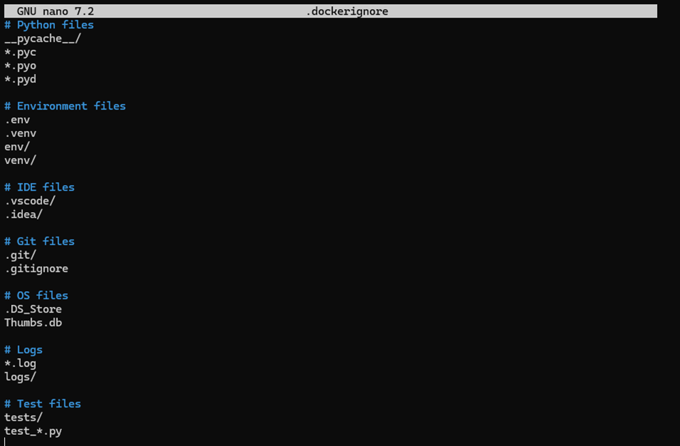
---

## Step 2: Importance of .dockerignore

- Prevents unnecessary files from being copied  
- Reduces image size  
- Improves build speed  
- Increases security  

---

# Part 3: Building Docker Images

## Step 1: Basic Build Command

```bash
docker build -t my-flask-app .
```
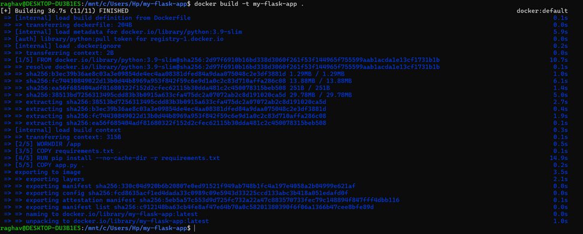

Check built images:

```bash
docker images
```
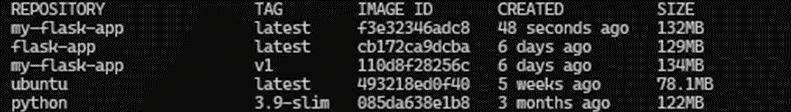
---

## Step 2: Tagging Images

Tag with version:

```bash
docker build -t my-flask-app:1.0 .
```
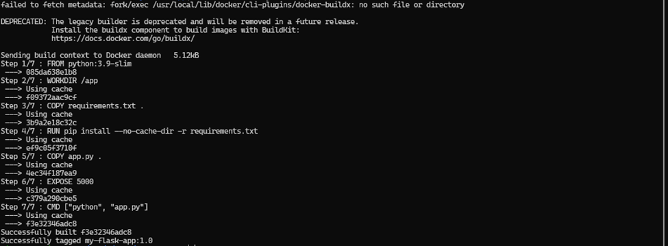

Multiple tags:

```bash
docker build -t my-flask-app:latest -t my-flask-app:1.0 .
```
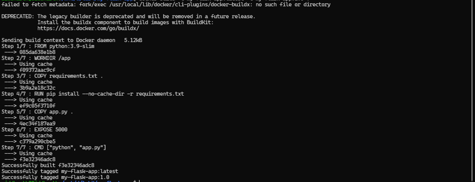
Tag for Docker Hub:

```bash
docker build -t username/my-flask-app:1.0 .
```
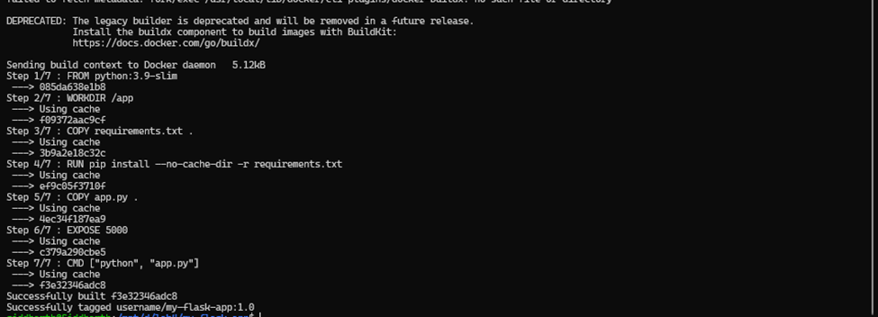
Tag existing image:

```bash
docker tag my-flask-app:latest my-flask-app:v1.0
```

---

## Step 3: View Image Details

List images:

```bash
docker images
```

Image history:

```bash
docker history my-flask-app
```

Inspect image:

```bash
docker inspect my-flask-app
```
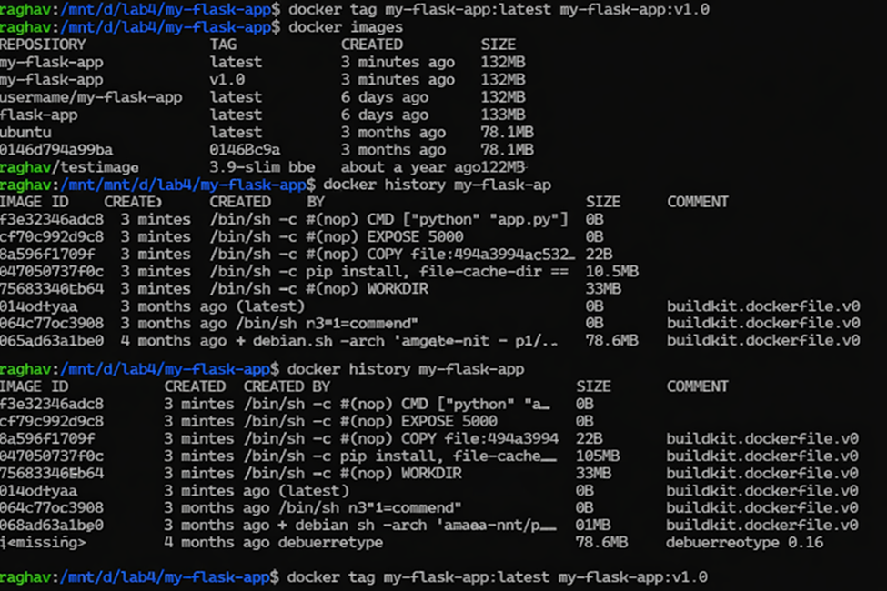

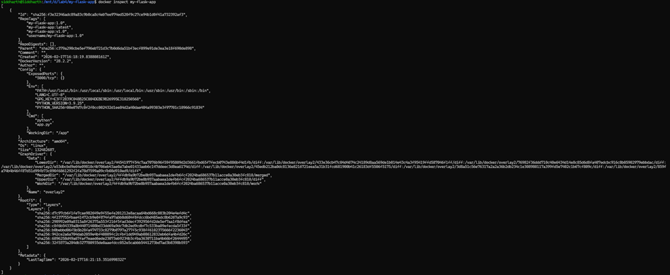
---

# Part 4: Running and Managing Containers

## Step 1: Run Container

```bash
docker run -d -p 5000:5000 --name flask-container my-flask-app
```

Test application:

```bash
curl http://localhost:5000
```

View running containers:

```bash
docker ps
```

View logs:

```bash
docker logs flask-container
```
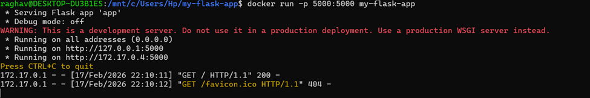

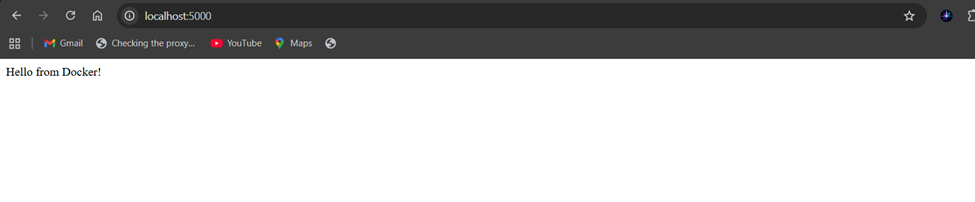
---

## Step 2: Manage Containers

Stop container:

```bash
docker stop flask-container
```

Start container:

```bash
docker start flask-container
```

Remove container:

```bash
docker rm flask-container
```

Force remove:

```bash
docker rm -f flask-container
```

### Explanation

- `docker rm` removes a stopped container.  
- Docker does not allow removal of a running container.  
- `docker rm -f` forcefully stops and removes it.  
- If the container is already deleted, Docker returns:  
  ```
  Error response from daemon: No such container
  ```
  This is expected behavior.

---

# Part 5: Multi-Stage Builds

## Why Multi-stage Builds?

- Smaller final image size  
- Better security  
- Separate build and runtime environments  

---

## Multi-stage Dockerfile

### Dockerfile.multistage

```dockerfile
# STAGE 1: Builder stage
FROM python:3.9-slim AS builder

WORKDIR /app

COPY requirements.txt .

RUN python -m venv /opt/venv
ENV PATH="/opt/venv/bin:$PATH"
RUN pip install --no-cache-dir -r requirements.txt

# STAGE 2: Runtime stage
FROM python:3.9-slim

WORKDIR /app

COPY --from=builder /opt/venv /opt/venv
ENV PATH="/opt/venv/bin:$PATH"

COPY app.py .

RUN useradd -m -u 1000 appuser
USER appuser

EXPOSE 5000

CMD ["python", "app.py"]
```
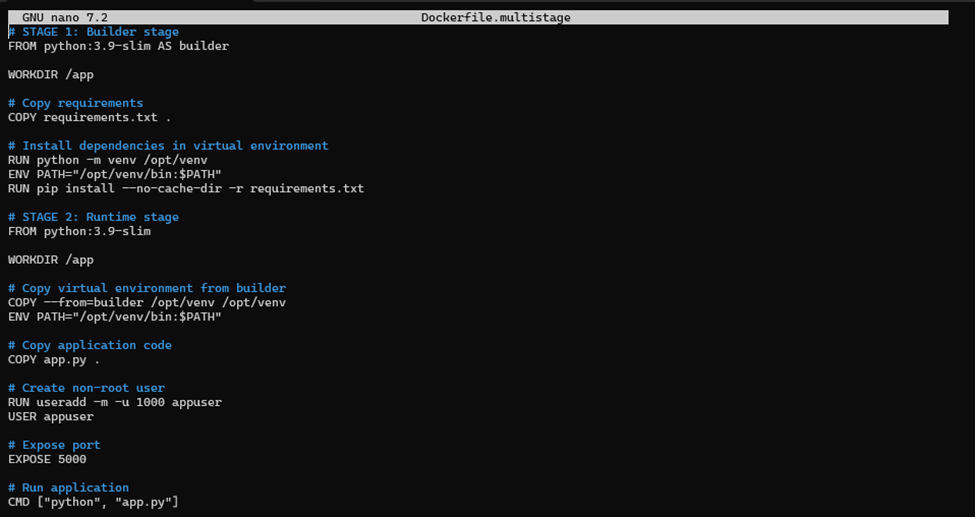
---

## Build and Compare

Build regular image:

```bash
docker build -t flask-regular .
```
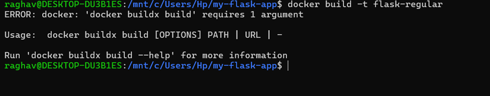

Build multi-stage image:

```bash
docker build -f Dockerfile.multistage -t flask-multistage .
```

Compare sizes:

```bash
docker images | grep flask-
```

Expected result:

- flask-regular → ~250MB  
- flask-multistage → ~150MB  
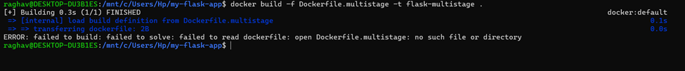
---

# Part 6: Publishing to Docker Hub

## Step 1: Login and Tag

```bash
docker login
```

Tag image:

```bash
docker tag my-flask-app:latest username/my-flask-app:1.0
docker tag my-flask-app:latest username/my-flask-app:latest
```

Push image:

```bash
docker push username/my-flask-app:1.0
docker push username/my-flask-app:latest
```
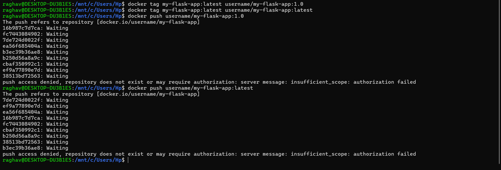

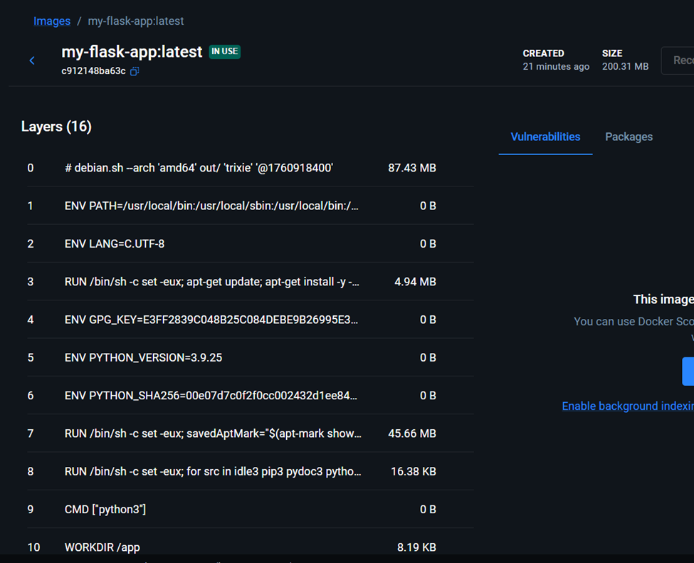

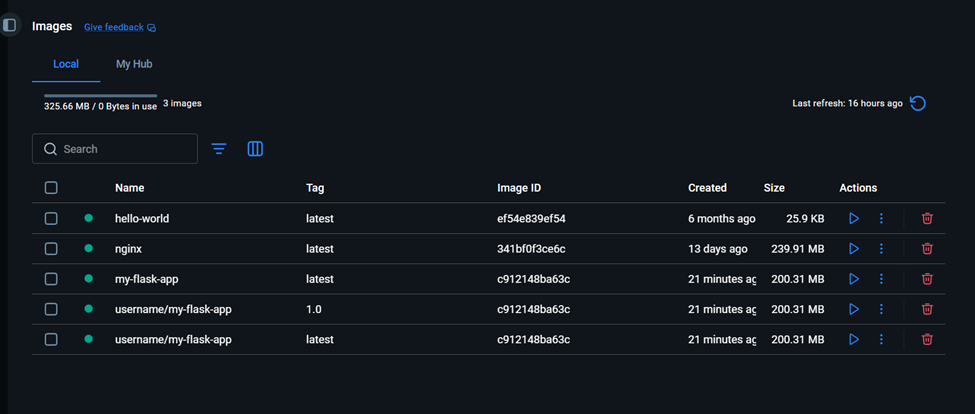
---

## Step 2: Pull and Run from Docker Hub

On another machine:

```bash
docker pull username/my-flask-app:latest
```

Run the pulled image:

```bash
docker run -d -p 5000:5000 username/my-flask-app:latest
```

---

# Result

The Flask application was successfully containerized using Dockerfile.  
Image tagging, multi-stage builds, and publishing to Docker Hub were performed successfully.

---

# Conclusion

This experiment demonstrated core Docker essentials including Dockerfile creation, image optimization using .dockerignore, tagging strategies, multi-stage builds, and image publishing. These concepts are fundamental in modern DevOps workflows for building efficient, secure, and portable containerized applications.